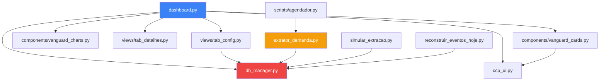

# 🔍 Relatório de Auditoria — CCP (Centro de Controle da Programação)

**Data:** 09/07/2026 | **Escopo:** Todos os arquivos do projeto | **Arquivos analisados:** 15+

---

## Resumo Executivo

| Severidade | Qtde | Descrição |
|---|---|---|
| 🔴 **CRÍTICO** | 5 | Bugs que causam crash ou dados incorretos em produção |
| 🟠 **ALTO** | 8 | Falhas de lógica, segurança ou inconsistências importantes |
| 🟡 **MÉDIO** | 9 | Problemas de manutenibilidade, código morto, duplicação |
| 🔵 **BAIXO** | 6 | Melhorias de qualidade, boas práticas |

---

## 🔴 CRÍTICOS (Corrigir Imediatamente)

### C-01: `get_agora_br()` usa `datetime` antes de importar
**Arquivo:** [db_manager.py](file:///c:/Users/c057573/OneDrive%20-%20CEMIG/Projetos/analise_demanda/db_manager.py#L3-L4)

```python
# Linha 3-4 — datetime.datetime usado, mas import está na linha 7
def get_agora_br():
    return datetime.datetime.utcnow() - datetime.timedelta(hours=3)
```

> [!CAUTION]
> A função `get_agora_br()` é definida na **linha 3**, mas o `import datetime` só ocorre na **linha 7**. Isso funciona por acaso pois Python resolve no momento da *chamada*, não da *definição*. Porém, se algum módulo importar diretamente `from db_manager import get_agora_br` antes que o módulo termine de carregar, causará `NameError`. A ordem está conceitualmente errada.

**Correção:** Mover `import datetime` para **antes** da definição da função (linha 1-2).

---

### C-02: `Tem_Email` — KeyError em produção quando extrator não roda
**Arquivo:** [dashboard.py](file:///c:/Users/c057573/OneDrive%20-%20CEMIG/Projetos/analise_demanda/dashboard.py#L721-L722)

```python
# Linha 721-722
alertas_com_email = alertas_pendentes[alertas_pendentes['Tem_Email'] == True].copy()
alertas_sem_email = alertas_pendentes[alertas_pendentes['Tem_Email'] != True].copy()
```

> [!CAUTION]
> A coluna `Tem_Email` só é criada pelo **extrator** (`extrator_demanda.py` linhas 795-810). Se o banco for alimentado por outra via, ou se a coluna não existir no snapshot, o dashboard **crasha com KeyError**. Não há nenhuma verificação de existência da coluna.

**Correção:** Adicionar guarda antes do acesso:
```python
if 'Tem_Email' not in alertas_pendentes.columns:
    alertas_pendentes['Tem_Email'] = False
```

---

### C-03: SQL Injection em `get_performance_d1`
**Arquivo:** [db_manager.py](file:///c:/Users/c057573/OneDrive%20-%20CEMIG/Projetos/analise_demanda/db_manager.py#L860-L868)

```python
# Linhas 860-868 — f-string com valores diretamente no SQL
query_eventos = f"""
    SELECT ... FROM eventos_diarios
    WHERE matricula_responsavel = '{matricula}'
    AND date(data_evento) BETWEEN '{data_inicio}' AND '{data_fim}'
    ...
"""
```

> [!CAUTION]
> Toda a função `get_performance_d1` usa **f-strings** para montar queries SQL com valores de `matricula`, `data_inicio`, `data_fim`, e listas de regiões/travadas. Embora os dados venham do banco, qualquer dado malicioso armazenado pode explorar isso. A mesma falha se repete nas linhas 890-916.

**Correção:** Usar `?` como placeholders parametrizados em todas as queries.

---

### C-04: `get_performance_d1` usa `get_connection_write()` para LEITURA
**Arquivo:** [db_manager.py](file:///c:/Users/c057573/OneDrive%20-%20CEMIG/Projetos/analise_demanda/db_manager.py#L851)

```python
conn_data = get_connection_write()  # ESCREVE no banco local 'demanda.db'
```

> [!CAUTION]
> A função `get_performance_d1` é chamada pelo **dashboard** (leitura), mas abre `get_connection_write()` que aponta para `demanda.db` local. O dashboard usa `get_connection_read()` que aponta para o banco da **rede** (`ccp_data.db`). Isso cria inconsistência: as queries de pendentes executam no banco **local desatualizado** em vez do banco da rede.

**Correção:** Substituir por `get_connection_read()`.

---

### C-05: `registrar_eventos_diarios` usa `date('now', 'localtime')` — inconsistente com `get_agora_br()`
**Arquivo:** [db_manager.py](file:///c:/Users/c057573/OneDrive%20-%20CEMIG/Projetos/analise_demanda/db_manager.py#L723-L729)

```python
# Linha 723 — SQLite usa o timezone do SO, enquanto get_agora_br() aplica UTC-3 manualmente
cursor.execute("SELECT COUNT(...) WHERE date(Data_Extracao) = date('now', 'localtime')")
```

> [!CAUTION]
> `date('now', 'localtime')` depende do timezone do servidor/máquina (que pode ser UTC em servidores). Porém `get_agora_br()` força UTC-3 manualmente. Se o SO estiver em UTC, as comparações falham: a extração será salva como horário de Brasília, mas o `date('now', 'localtime')` retornará UTC. Isso é a **causa raiz** dos bugs de D-1 relatados nas conversas anteriores.

**Correção:** Usar `get_agora_br().strftime('%Y-%m-%d')` como parâmetro em vez de `date('now', 'localtime')`.

---

## 🟠 ALTO (Corrigir em Breve)

### A-01: Comentário numerado duplicado no `init_database`
**Arquivo:** [db_manager.py](file:///c:/Users/c057573/OneDrive%20-%20CEMIG/Projetos/analise_demanda/db_manager.py#L511-L537)

Os comentários de numeração estão **errados**: existem dois `# 4.` (linhas 501 e 511) e dois `# 5.` (linhas 525 e 537). Isso indica que tabelas foram adicionadas sem atualizar a numeração, dificultando manutenção.

---

### A-02: `login_screen()` aceita parâmetro `cookie_manager` mas o chamador não passa
**Arquivo:** [dashboard.py:89](file:///c:/Users/c057573/OneDrive%20-%20CEMIG/Projetos/analise_demanda/dashboard.py#L89) vs [ccp_ui.py:362](file:///c:/Users/c057573/OneDrive%20-%20CEMIG/Projetos/analise_demanda/ccp_ui.py#L362)

```python
# dashboard.py linha 89
login_screen()  # Sem argumento

# ccp_ui.py linha 362
def login_screen(cookie_manager=None):  # Espera receber cookie_manager
```

Resultado: Na `login_screen`, a branch `if cookie_manager:` (linha 432) **nunca é executada**. O token é sempre passado via query param (`st.query_params["ctoken"]`), nunca via cookie direto no login. Isso torna o fluxo de cookie no login **morto**.

---

### A-03: Tema hardcoded `'Dark'` no calendário
**Arquivo:** [dashboard.py](file:///c:/Users/c057573/OneDrive%20-%20CEMIG/Projetos/analise_demanda/dashboard.py#L259)

```python
is_dark = st.session_state.get('control_theme', 'Dark') == 'Dark'
```

A variável `control_theme` **nunca é setada** em nenhum lugar do projeto. Isso significa que `is_dark` é **sempre True**. O calendário sempre renderiza em modo escuro, mesmo que o Streamlit esteja em modo claro.

---

### A-04: `bare except` silencioso em múltiplos locais
**Arquivos:** dashboard.py (linhas 155, 307, 357, 545), extrator_demanda.py (linhas 241, 257, 294, 307, 460), db_manager.py

Padrão recorrente:
```python
except:
    return None  # Engole qualquer exceção sem logar
```

Há **15+ ocorrências** de `except:` genérico sem logging. Isso dificulta enormemente o diagnóstico de problemas em produção.

---

### A-05: `import streamlit as st` redundante dentro de função cached
**Arquivo:** [dashboard.py](file:///c:/Users/c057573/OneDrive%20-%20CEMIG/Projetos/analise_demanda/dashboard.py#L441)

```python
# Dentro de load_latest_data() que é @st.cache_data
import streamlit as st  # Já importado na linha 1
```

Import redundante e desnecessário dentro de uma função cacheada.

---

### A-06: `Região` vs `Solicitação` — inconsistência de nomes de colunas
**Arquivo:** [dashboard.py](file:///c:/Users/c057573/OneDrive%20-%20CEMIG/Projetos/analise_demanda/dashboard.py#L858)

```python
cols_prioridade = ['Solicitação', 'Responsavel', 'Região', col_malha, ...]
```

A coluna `'Região'` é referenciada mas o nome real é `'Ref_Regiao'` ou o valor de `col_regiao`. O `Responsavel` não tem acento mas é mostrado como coluna. Isso pode causar colunas invisíveis no diálogo KPI.

---

### A-07: `datetime` importado de duas formas conflitantes no Histórico
**Arquivo:** [dashboard.py](file:///c:/Users/c057573/OneDrive%20-%20CEMIG/Projetos/analise_demanda/dashboard.py#L1104-L1280)

```python
# Linha 7: from datetime import datetime, date
# Linha 1199: from datetime import date  # Re-importa
# Linha 1203: from datetime import date, timedelta  # Re-importa
# Linha 1279: import datetime  # Importa o módulo inteiro!
# Linha 1280: hoje = datetime.date.today()  # Usa datetime.date
```

Na linha 1104, `datetime.now()` é chamado sem qualificador — funciona por causa do import da linha 7. Mas na linha 1280, `datetime.date.today()` usa o **módulo** reimportado na 1279, sobrescrevendo a **classe** importada na linha 7. Isso é frágil e pode quebrar.

---

### A-08: Credenciais salvas em **plaintext** no JSON
**Arquivo:** [scripts/configurar_credenciais.py](file:///c:/Users/c057573/OneDrive%20-%20CEMIG/Projetos/analise_demanda/scripts/configurar_credenciais.py#L14-L15)

```python
json.dump({"usuario": usuario, "senha": senha}, f, ensure_ascii=False)
```

As credenciais do GDIS são salvas em texto plano em `~/.dashboard_mt/credenciais.json`. Sem nenhuma criptografia.

---

## 🟡 MÉDIO (Planejar Correção)

### M-01: Código morto — `inject_ui_assets()` chamado DUAS vezes
**Arquivo:** [dashboard.py](file:///c:/Users/c057573/OneDrive%20-%20CEMIG/Projetos/analise_demanda/dashboard.py#L107) e [dashboard.py](file:///c:/Users/c057573/OneDrive%20-%20CEMIG/Projetos/analise_demanda/dashboard.py#L700)

```python
inject_ui_assets()  # Linha 107
# ... 600 linhas depois ...
inject_ui_assets()  # Linha 700 — DUPLICADO
```

O JavaScript do relógio é injetado duas vezes, podendo causar dois `setInterval` correndo em paralelo (a guarda `ccpClockSet` mitiga, mas ainda gera HTML desnecessário).

---

### M-02: Comentário duplicado no topo do `dashboard.py`
**Arquivo:** [dashboard.py](file:///c:/Users/c057573/OneDrive%20-%20CEMIG/Projetos/analise_demanda/dashboard.py#L34-L35)

```python
# Inicializa banco de dados de sessões no startup
# Inicializa banco de dados de sessões no startup  # DUPLICADO
```

---

### M-03: Bloco `if st.session_state.logged_in: pass` — completamente vazio
**Arquivo:** [dashboard.py](file:///c:/Users/c057573/OneDrive%20-%20CEMIG/Projetos/analise_demanda/dashboard.py#L98-L99)

```python
if st.session_state.logged_in:
    pass  # Nenhum efeito
```

---

### M-04: `import db_manager` redundante dentro de `load_latest_data`
**Arquivo:** [dashboard.py](file:///c:/Users/c057573/OneDrive%20-%20CEMIG/Projetos/analise_demanda/dashboard.py#L285)

```python
import db_manager  # Já importado globalmente na linha 9
```

O comentário diz "Quebra de cache", mas reimportar um módulo em Python **não** invalida cache do Streamlit.

---

### M-05: CSS duplicado para `@keyframes pulse-red`
**Arquivo:** [ccp_ui.py](file:///c:/Users/c057573/OneDrive%20-%20CEMIG/Projetos/analise_demanda/ccp_ui.py#L149-L153) e [dashboard.py](file:///c:/Users/c057573/OneDrive%20-%20CEMIG/Projetos/analise_demanda/dashboard.py#L633-L637)

A mesma animação `pulse-red` é definida em dois lugares com valores ligeiramente diferentes (15px vs 10px). Isso pode causar conflitos de CSS.

---

### M-06: `schedule` no requirements.txt mas **não** é utilizado
**Arquivo:** [requirements.txt](file:///c:/Users/c057573/OneDrive%20-%20CEMIG/Projetos/analise_demanda/requirements.txt#L5)

```
schedule==1.2.2
```

O pacote `schedule` não é importado em nenhum arquivo do projeto. O agendador usa `time.sleep()` em loop.

---

### M-07: Scripts de debug/fix com caminhos hardcoded de rede
**Arquivos:** `fix_timestamps.py`, `debug_tratadas.py`, `reconstruir_eventos_hoje.py`

Estes scripts contêm caminhos absolutos hardcoded (`I:\\IT\\ODCO\\...`) e não usam `db_manager.get_app_db_path()`. Se executados em ambiente diferente, falham silenciosamente.

---

### M-08: `agendador_teste.py` na raiz — arquivo de teste no diretório de produção
**Arquivo:** [agendador_teste.py](file:///c:/Users/c057573/OneDrive%20-%20CEMIG/Projetos/analise_demanda/agendador_teste.py)

Arquivo de teste abandonado na raiz do projeto.

---

### M-09: `.env` está no `.gitignore` mas é necessário para o projeto funcionar
**Arquivo:** [.gitignore](file:///c:/Users/c057573/OneDrive%20-%20CEMIG/Projetos/analise_demanda/.gitignore#L126)

O `.env` é ignorado pelo Git, mas não existe um `.env.example` documentando quais variáveis são necessárias. Novos desenvolvedores não saberão configurar o ambiente.

---

## 🔵 BAIXO (Melhorias Recomendadas)

### B-01: Sem `__init__.py` nos pacotes `components/` e `views/`
Embora funcione como importação direta, a ausência do `__init__.py` dificulta reuso e testes.

### B-02: `Logs_30-06.txt` (377KB) e `CCP_Portable.zip` (199MB) na raiz
Arquivo de log grande e ZIP de distribuição não deveriam estar versionados ou na raiz.

### B-03: Sem tratamento de tipo de retorno em `atualizar_senha`
A função retorna `True` em sucesso, mas retorna a **string do erro** em falha (não `False`). O chamador faz `if result is True:` o que funciona, mas o contrato é confuso.

### B-04: Feriados hardcoded até 2026
A lista `FERIADOS_BASE` precisa ser atualizada manualmente todo ano. Considerar usar uma biblioteca como `workalendar` ou um endpoint de feriados.

### B-05: `.streamlit/` vazio
O diretório de configuração do Streamlit existe mas está vazio. Sem `config.toml`, o tema padrão fica indefinido.

### B-06: CSS para `st.tabs` em `ccp_ui.py` está obsoleto
O dashboard usa `st.segmented_control` (linhas 928-990) com CSS customizado, mas `ccp_ui.py` ainda contém CSS extenso para `st.tabs` (linhas 156-323) que nunca é aplicado. Código morto de CSS.

---

## Mapa de Dependências



---

## Priorização de Correções

| # | Item | Esforço | Impacto |
|---|---|---|---|
| 1 | C-02 | 🟢 5 min | Previne crash em produção |
| 2 | C-04 | 🟢 5 min | Corrige dados inconsistentes no D-1 |
| 3 | C-05 | 🟡 30 min | Corrige bugs de timezone nos eventos |
| 4 | C-01 | 🟢 2 min | Corrige risco de NameError |
| 5 | C-03 | 🟡 30 min | Elimina SQL Injection |
| 6 | A-02 | 🟢 5 min | Restaura funcionalidade de cookie no login |
| 7 | A-03 | 🟢 5 min | Corrige tema do calendário |
| 8 | A-07 | 🟡 15 min | Elimina conflito de imports |
| 9 | M-01 | 🟢 2 min | Remove injeção duplicada |
| 10 | M-06 | 🟢 2 min | Remove dependência não utilizada |
